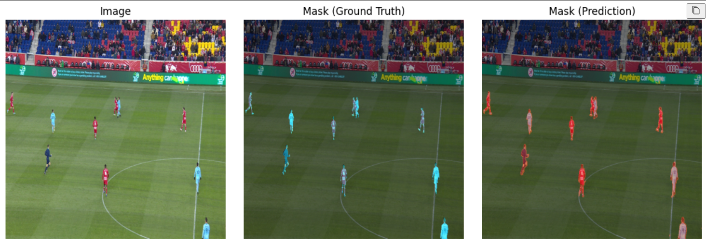

# Football Player Segmentation

A deep learning model using U-Net architecture to segment football players from images.

## Overview
- Implements semantic segmentation using U-Net
- Trained on football match images to detect and segment players
- Built with TensorFlow/Keras
- Achieves segmentation using binary masks

## Requirements
- TensorFlow 
- OpenCV
- NumPy
- Matplotlib
- PIL
- Kaggle dataset: "football-player-segmentation"

## Model Architecture
- U-Net with:
  - Encoder path (4 blocks)
  - Bottleneck
  - Decoder path (4 blocks)
  - Input size: 512x512x3
  - Output: Binary segmentation mask

## Metrics
- Dice coefficient
- Jaccard index (IoU)
- Binary accuracy
- Binary cross-entropy loss

## Results
